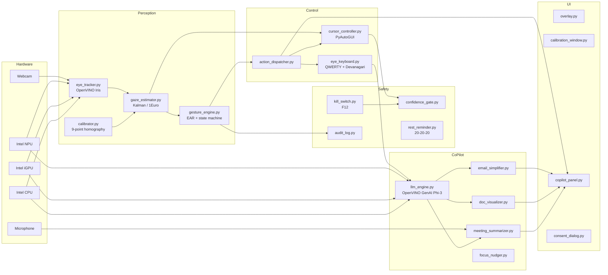

# SahaayakAI Architecture

## Component map



## Inference routing

`utils.intel_device.get_best_device(kind)` consults
`openvino.Core().available_devices` and routes:

| Workload | Preference order | Notes |
|---|---|---|
| Iris / face landmarks (vision) | NPU → GPU → CPU | Tiny model, latency-bound |
| Phi-3-mini-int4 (LLM) | NPU → GPU → CPU | Memory-bound; INT4 fits NPU |

## Per-frame data flow

1. `cv2.VideoCapture` yields a BGR frame (640x480 @ 30 FPS).
2. `EyeTracker.process(frame)` runs face-detection + iris IR via OpenVINO,
   returning iris coords, eyelid landmarks, EAR, confidence.
3. `GazeEstimator.estimate(...)` applies the calibration homography and the
   Kalman / 1-Euro smoothing, returning a `GazePoint`.
4. `ConfidenceGate.update(...)` either lets the move proceed or freezes it.
5. `CursorController.move(x, y)` interpolates over N steps.
6. `GestureEngine.step(...)` watches EAR + dwell + zone state; emits 0+
   gestures. `ActionDispatcher.dispatch(...)` translates each into an OS
   action, an audit entry, and (for winks) a UI toggle.
7. `GazeOverlay.update_position(...)` repaints the reticle.

## LLM data flow

```
Email body / PDF text / WAV transcript
        |
   Prompt template (copilot/prompts/*.txt)
        |
   LLMEngine.generate()  —>  OpenVINO GenAI Phi-3 (NPU)
        |
   JSON parser (email_simplifier / meeting_summarizer / doc_visualizer)
        |
   Structured dataclass  —>  CopilotPanel  —>  user
```

The user explicitly long-blinks to send a draft. The dispatcher never
auto-sends.

## Threading

* Main thread: PyQt6 event loop + frame loop.
* `KillSwitch`: pynput keyboard listener (daemon thread).
* `RestReminder`: `threading.Timer` (daemon).
* `LLMEngine.generate`: short-lived worker thread for timeout enforcement.

All IPC between threads is via small `Queue`s or atomic flags — there are
no shared mutable structures without an `RLock`.

## Files that are *intentionally* never written

* Webcam frames
* Iris embeddings / landmark vectors
* Microphone audio (transcript only)
* Email body content beyond the in-RAM lifetime of one request
* Active-window titles (only an 8-byte digest in `focus_nudger`)
